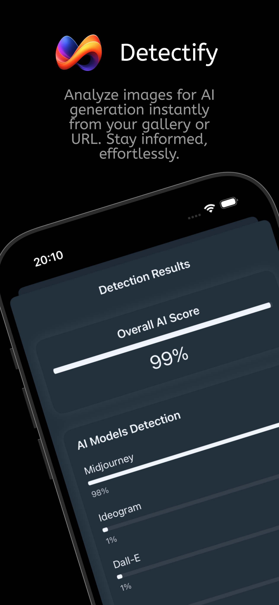
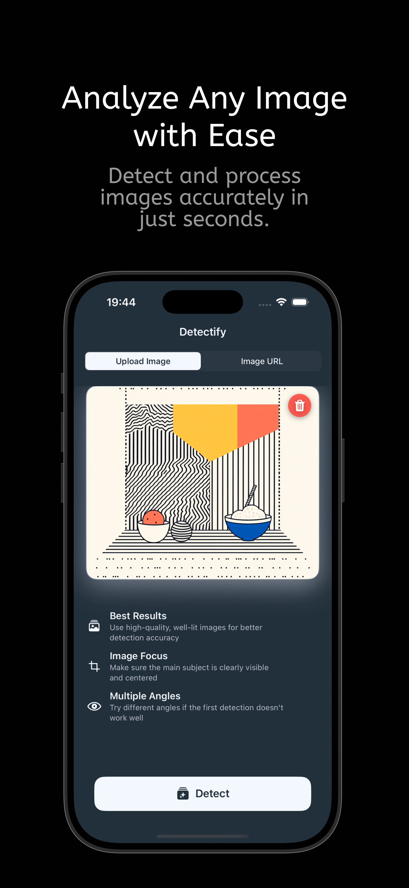
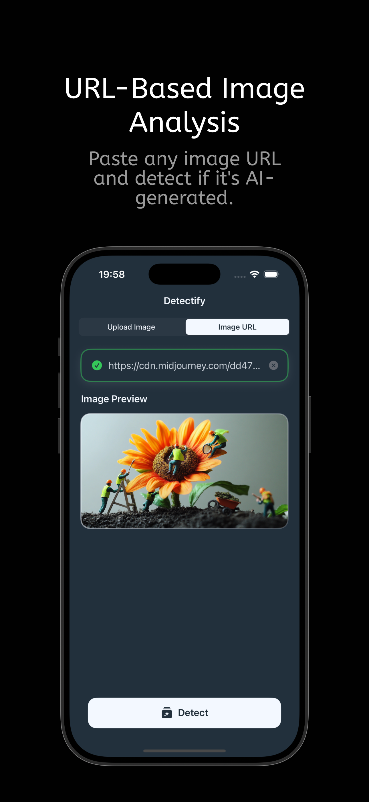
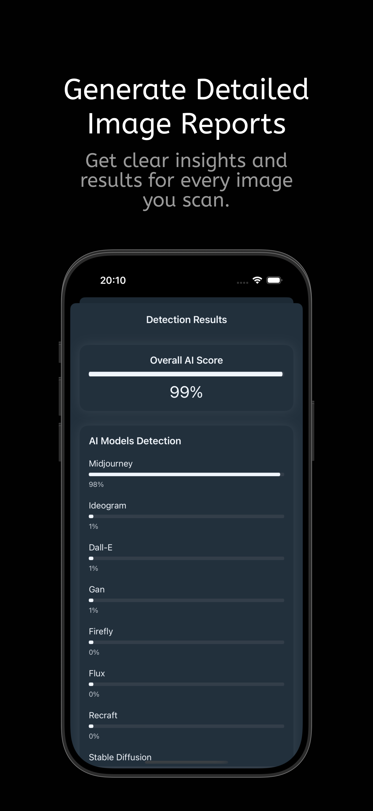
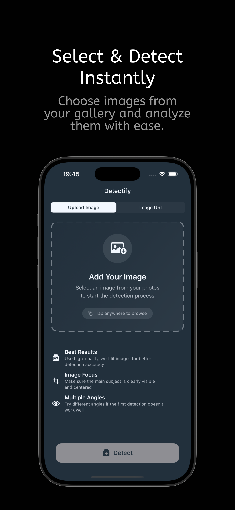

# AI Image Detector: Detectify

    
   

Welcome to Detectify, your go-to mobile app for verifying the authenticity of images. In an era where AI-generated images are increasingly common, Detectify empowers you to distinguish between real and AI-created visuals with ease. Download now from the App Store!

## What is Detectify?
Detectify is a powerful, user-friendly app that analyzes images to determine if they are AI-generated or authentic. Whether you upload a photo from your device or provide an image URL, our advanced AI-powered detection technology delivers fast and accurate results, helping you navigate the world of digital content with confidence.

## Key Features
**Instant Image Analysis:** Upload an image or paste a URL to check its authenticity in seconds.
**High Accuracy:** Built with cutting-edge machine learning to detect subtle signs of AI generation.
**Simple Interface:** Designed for ease of use, no technical expertise required.
**Confidence Scores:** Get clear results with a percentage indicating the likelihood of AI generation.

## Download Now
Ready to uncover the truth behind images? Download Detectify from the App Store and start verifying today!
[Download on the App Store](https://apps.apple.com/tr/app/ai-image-detector-detectify/id6739735839)
